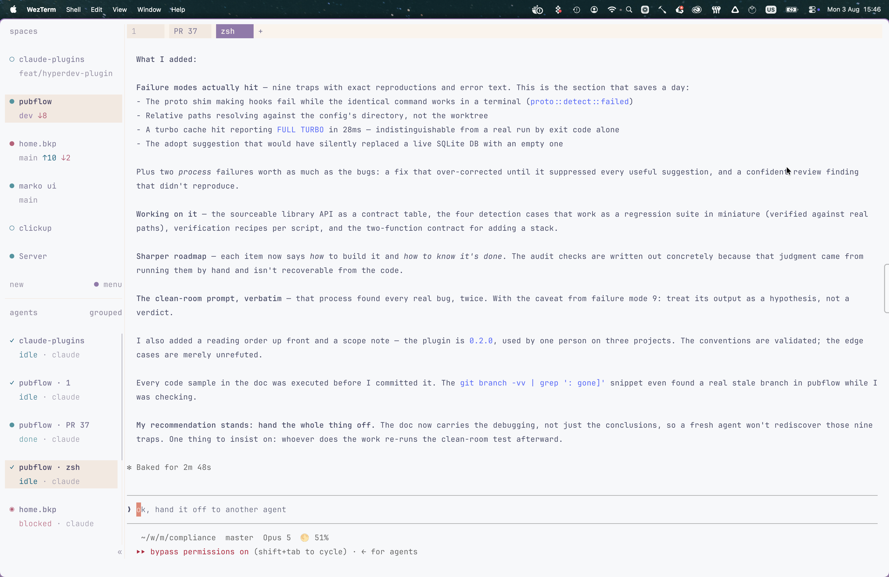

# Marko for Zed

Zed language extension for [Marko](https://markojs.com) (`.marko` files):
syntax highlighting (Tree-sitter), TypeScript/CSS injections, and LSP support
via `@marko/language-server`.

## Features

- Tree-sitter syntax highlighting for `.marko` files (tags, attribute tags,
  `<let>`/`<const>`, control-flow tags, concise-mode text)
- TypeScript and CSS injections inside script/style blocks
- Full LSP support via `@marko/language-server`, auto-installed from npm
- Automatic TypeScript default-lib patching so type diagnostics work even in
  projects without `node_modules`

## Installation

**From the Zed extension registry:** coming soon — the submission is under
review in [zed-industries/extensions#7393](https://github.com/zed-industries/extensions/pull/7393).
Once merged, search for "Marko" in Zed's extensions page (`zed: extensions`)
and install from there.

**Manual install (until then):**

1. Get the source: `git clone https://github.com/svallory/marko-zed.git`, or
   download and unpack the source archive of the
   [latest release](https://github.com/svallory/marko-zed/releases/latest).
2. Make sure a Rust toolchain is installed ([rustup](https://rustup.rs)) —
   Zed compiles dev extensions locally.
3. In Zed, open the extensions page (`zed: extensions`), click
   **Install Dev Extension**, and select the cloned/unpacked directory.
4. Open any `.marko` file — highlighting is immediate; the language server
   is downloaded from npm on first use, so diagnostics and completions
   appear after a few seconds.

> **Tip:** for type-aware diagnostics in your own project, have a
> `tsconfig.json` whose `include` covers your `.marko` files — without one,
> the language server treats them as plain JS and skips type checking.

## How it works

The extension installs `@marko/language-server` from npm on demand and runs
it through the Node runtime Zed provides, over stdio. After installing, it
copies TypeScript's default `lib.*.d.ts` files into the server's bundle —
the npm build of the server ships without them and otherwise loses every
global type (`Promise`, `Date`, ...) in projects with no `node_modules`;
the official VS Code extension does the same copy at build time.

## Grammar

The Tree-sitter grammar and queries are sourced from
[marko-js/tree-sitter](https://github.com/marko-js/tree-sitter), pinned to a
commit in `extension.toml`.

## Troubleshooting

- **No diagnostics / completions:** open the LSP log (`debug: open language
  server logs`) and select "Marko Language Server". If it isn't listed,
  check your Zed `settings.json` for a `language_servers` list — a value
  like `["!eslint"]` without the `"..."` sentinel disables **all** servers
  for languages without built-in defaults, Marko included. Use
  `["!eslint", "..."]`.
- **Startup details:** `~/Library/Logs/Zed/Zed.log` (macOS) shows the
  server install and launch lines (`starting language server process ...
  bin.js --stdio`).

## Contributing

Bug reports, feature requests, and PRs are welcome. See
[CONTRIBUTING.md](CONTRIBUTING.md) for dev setup, the build/lint commands, and
the PR process.

## License

[MIT](LICENSE)
